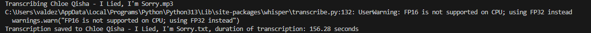

# 🎙️ Audio Transcription Script

Python script developed to automate the transcription of audio files into a .txt file using OPENAI's Whisper base model

---
 
## 🖥️ Features

- Automatically transcribes audio files from a specified folder.
- Supports .mp3, .wav, and .m4a formats.
- Saves transcriptions as .txt files in an output folder.
- Displays processing time for each audio file.

---

## 📂 Project Structure Example
```text
Transcription/
│
├── transcribe.py
├── audios/
├── transcriptions/
├── assets/
│   └── transcription_sc.png
└── README.md
```

---

## 🛠️ Technologies Used
- Python
- Whisper

---

## 🚀 How To Use
1. Clone the repository
```bash
git clone git@github.com:leovaldezhq/transcript.git
```
2. Install dependencies
```bash
pip install -U openai-whisper
```
3. Place audio files in the audios folder

4. Run the script
```bash
python transcribe.py
```
5. Check the transcriptions folder for output .txt files

---
## 📸 Example Output

⚠️<i> FP16 warning is normal when running on CPU <i>

---
Developed by Leo Valdez


